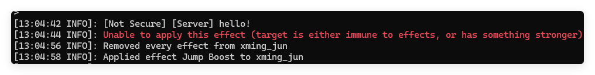

# Gatekeeper Dashboard

A modern web dashboard for managing Minecraft servers with real-time player monitoring, command execution, and server management features.


## Features

- **JWT Authentication**
  - Secure login system
  - Protected routes for admin access
  

- **Server Management**
  - Real-time server uptime monitoring
  - Command execution interface with history
  - Clean, modern UI with Tailwind CSS

- **Player Management**
  - Real-time player list with auto-refresh
  - Detailed player information view
  
  - Player actions:
    - Send private messages
    - Kick players with custom reason

- **Authentication**
  - Secure JWT-based authentication
  - Protected routes and API endpoints

## Prerequisites

- Node.js 16 or higher
- pnpm
- Running Minecraft server with Gatekeeper plugin

## Installation

1. Clone the repository
2. Install dependencies:
```bash
pnpm install
```

## Development

Start the development server:

```bash
pnpm dev
```

The dashboard will be available at http://localhost:3000

Default login credentials:
- Username: admin
- Password: 123456

## Project Structure

```
src/
├── app/                   # Next.js app router pages
├── components/           
│   ├── auth/             # Authentication components
│   ├── command/          # Command execution interface
│   ├── layout/           # Layout components
│   ├── players/          # Player management components
│   └── server/           # Server status components
└── lib/
    └── api.ts            # API utilities and types
```

## API Integration

The dashboard connects to a Minecraft server running the Gatekeeper plugin. Make sure your server is running and accessible at `http://127.0.0.1:8080` (default configuration).

## Technologies

- Next.js 15
- React 19
- TypeScript
- Tailwind CSS
- SWR for data fetching
- Axios for API requests

## Screenshots

### Run command just like in the terminal

